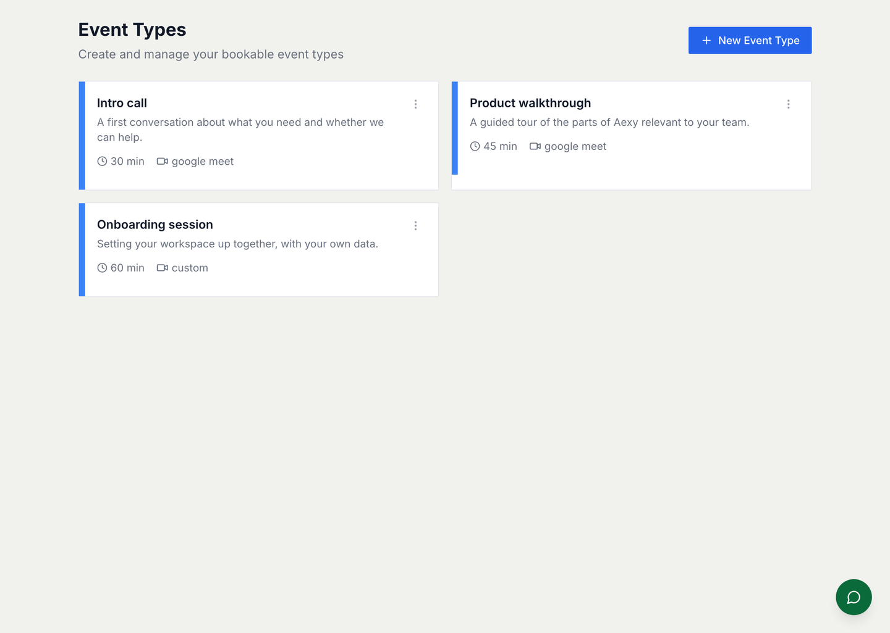
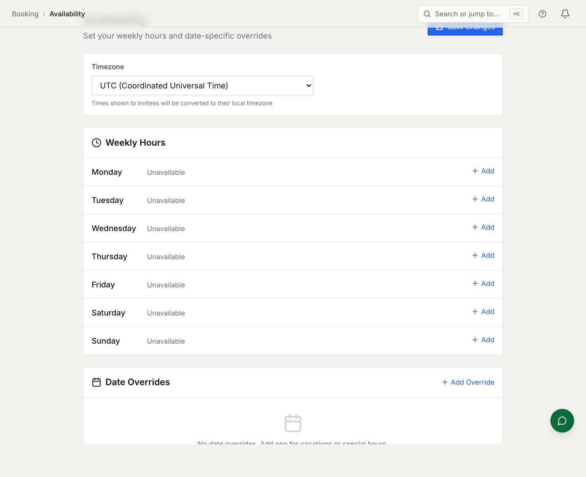

# Booking

Letting people book time with you without the email thread. Meeting types with
their own length and rules, availability from your real calendar, and a public
link you can put anywhere.

For provider setup, endpoints and the schema — including the Google and
Microsoft configuration — see
[Booking architecture & setup](./booking-architecture.md).

## Meeting types

A meeting type is what somebody chooses when they book: a name, a length, where
it happens, and the rules around it.

The rules matter more than they look:

* **Minimum notice** — how close to now somebody may book. A 30-minute intro
  call at two hours' notice is fine; an onboarding session at two hours' notice
  is not.
* **Buffers** — dead time before and after, so a day of back-to-backs has gaps
  in it.
* **How far ahead** bookings are allowed, which is what stops somebody
  reserving a slot in June.
* **Questions** you want answered on the way in.

## Availability

Slots are not a list you maintain. They are your working hours **minus what is
already in your calendar**, which is why the calendar connection is the part
that has to work — see [Email and inbox setup](./guides/email-setup.md) for
connecting one.

Until an account is connected, a booking page has hours but no way to know what
is already in them, and shows nothing. That is the honest state of a fresh
workspace rather than a fault.

## Booking with a team

A meeting type can belong to a team instead of a person, and the assignment
mode decides who ends up in the meeting:

| Mode | What happens |
|---|---|
| **Round robin** | Each booking goes to the next person in turn |
| **Collective** | Whoever is free takes it |
| **All hands** | Everybody attends, and each person RSVPs |

Round robin distributes load; collective fills the earliest slot; all hands is
for the meetings that genuinely need the room.

## The public link

Every workspace has a booking page, and every meeting type has its own address
under it. A team-specific link is one level deeper again, so "book time with
support" and "book time with Priya" can both exist without either being the
default.

Nobody needs an account to use them.

## Common mistakes

- **Publishing a link before connecting a calendar.** The page works and offers
  nothing, which reads as broken.
- **No minimum notice on a meeting that needs preparation.** Somebody will book
  it for twenty minutes' time, and they are not wrong to.
- **No buffers.** Six back-to-back calls is a day nobody can do twice.
- **Round robin on a team where one person is usually unavailable.** The turn
  still comes to them; collective is the mode for uneven availability.
- **Assuming a booking cancels the hold if the meeting is declined.** An
  all-hands RSVP records who is coming; it does not withdraw the slot.
