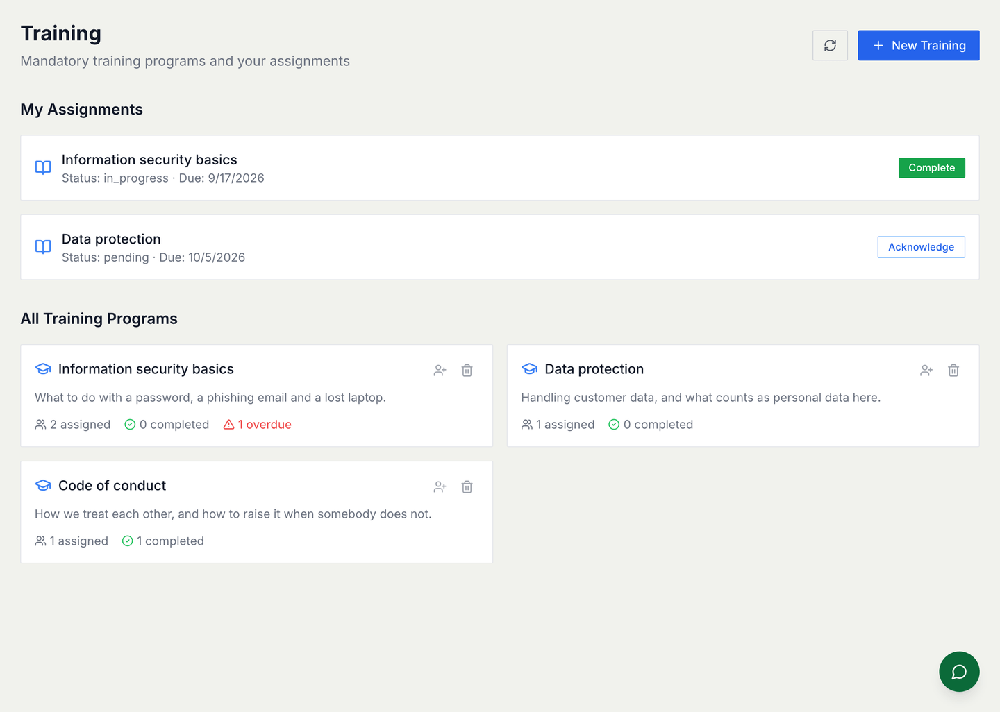
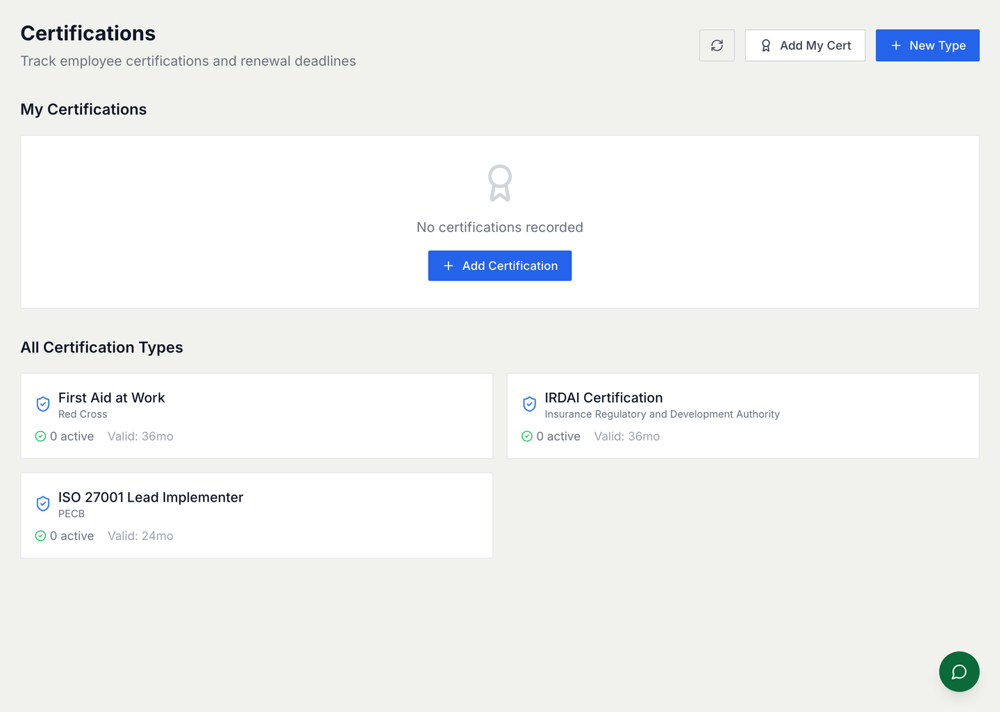

# Compliance

The things people have to do because somebody outside the company says so:
training that must be completed, certifications that must not lapse, and
evidence that both actually happened.

For how it is built — models, schedules, the audit log — see
[Compliance architecture](./compliance-architecture.md).

## Mandatory training

A **training programme** is the thing to be done. An **assignment** is one
person owing it, with a due date.

Programmes are assigned to everybody, to particular teams, or to named people,
and they can **recur** — annually for security awareness, every two years for
data protection, once for a code of conduct that only changes when it changes.
A recurring programme reassigns itself when it comes round, which is the whole
reason to record it here rather than in a calendar.

The screen answers two questions at once: what *you* owe, at the top, and how
each programme is going across everybody, below. "2 assigned · 1 overdue" is
the number a compliance officer actually needs.

### Acknowledged is not completed

Two timestamps, and the difference matters at audit time:

* **Acknowledged** — the person has seen it.
* **Completed** — the work is done.

Reports count completions. Acknowledging something does not take it off the
overdue list, and it should not.

## Certifications

A certification is issued by somebody outside the company — a regulator, a
training body, a standards organisation — and typically expires. Recording one
here gives you the expiry date and the renewal window, so a lapse is visible
before it happens rather than during an audit.

Waiving somebody's training does **not** grant them a certification. They are
different records with different lifecycles, and the waiver applies only to the
thing it was granted against.

## Reminders and evidence

Recurring obligations that are neither a course nor a certificate — filing a
return, running a test restore, reviewing access — are reminders, with owners
and schedules. The narrower how-to is [Reminders](./guides/reminders.md).

Where a reminder **requires evidence**, it is not complete until something is
attached. The check runs daily, so an item marked done without evidence will
start reminding again — which looks like a bug and is the control working.

## When something is late

Escalation is a ladder rather than a nag: the person, then their manager, then
whoever owns the obligation. It is worth configuring deliberately, because an
escalation that goes straight to the top is one everybody learns to ignore.

## The audit log

Everything is recorded, and the log is **append-only**. Nothing edits or
deletes a row, and that is the point: an auditor looks for gaps, and a tidy
history is a suspicious one.

## Common mistakes

- **Marking things acknowledged and expecting them to clear.** Only completion
  clears an assignment.
- **Completing an evidence-backed item without the evidence.** It comes back.
- **Assuming a waiver covers the certification too.** It does not.
- **Bulk-assigning a list that has somebody inactive in it.** The assignment is
  all-or-nothing, so one bad row loses the batch. Check the list first.
- **Recording a certification without its expiry.** Then nothing can warn you,
  and the module is a filing cabinet.
