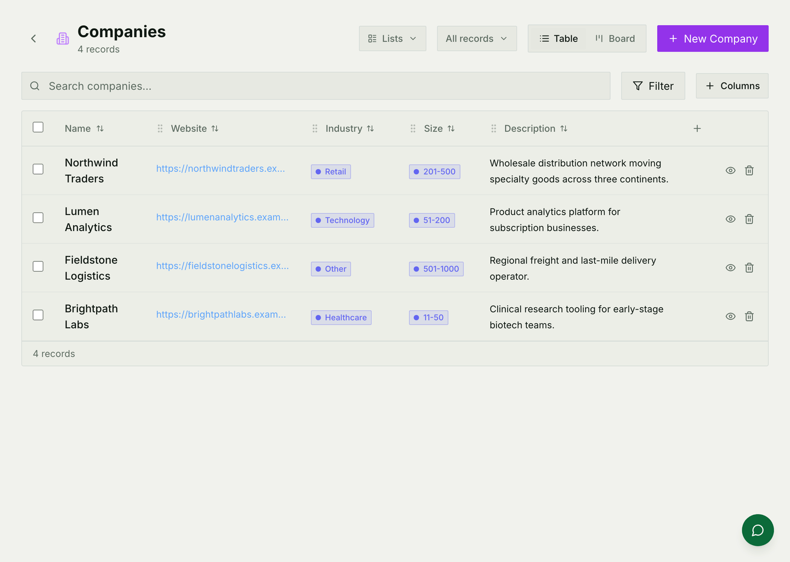
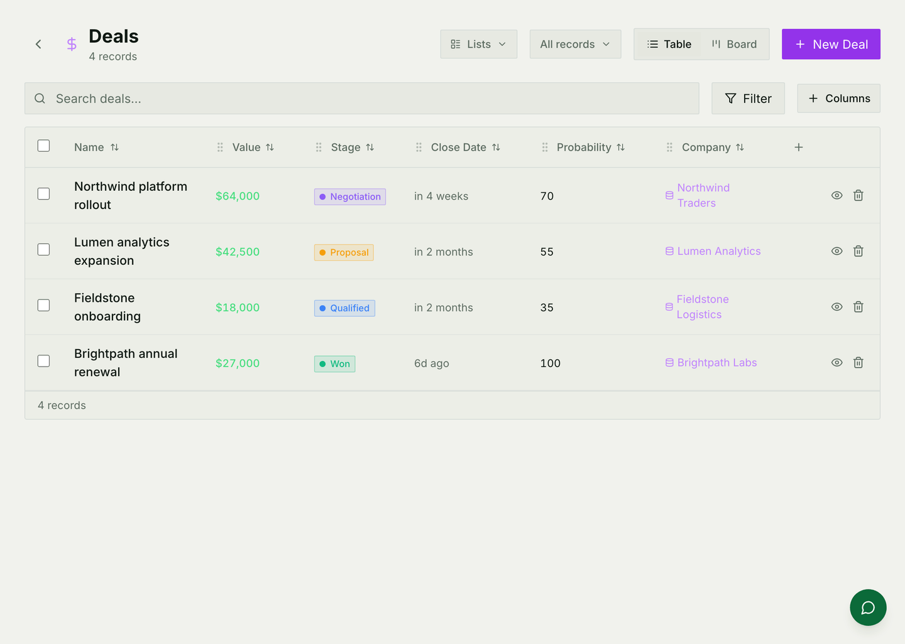
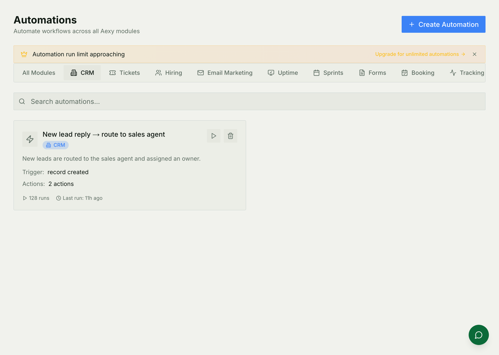

# CRM

Companies, the people at them, the deals in progress, and anything else your
organisation needs to keep a record of. The shape is deliberately open: what a
"record" is here is up to you.

For how it is built — storage, the attribute system, the automation engine —
see [CRM architecture](./crm-architecture.md).

## The shape of it

| | What it is |
|---|---|
| **Object** | A kind of thing — Company, Person, Deal, or one you define |
| **Attribute** | A field on that kind: text, number, date, a choice, a link to another record, or one the AI fills in |
| **Record** | One of them — a company, a person, a deal |
| **List** | A saved view: a filter, a sort, the columns you want, as a table, board, calendar, timeline or gallery |
| **Activity** | What happened to a record — an email opened, a stage changed, a note added |

Companies, People and Deals come as standard. Everything about them is
editable, and a workspace that needs Properties, Vessels or Grant Applications
adds an object rather than bending Deals into the wrong shape.

## Working with records

Every object gets the same view: search, filters, a column picker, and a
switch between table and board. What differs is the columns, because those come
from the attributes you defined.

Deals are the same machinery with a stage attribute, which is what makes the
board view a pipeline. Moving a card changes the stage, and the change is
recorded on the record's timeline — so "when did this slip?" has an answer.

Lists are saved views, not copies. A list called *Enterprise, this quarter* is
a filter over the same records everybody else is looking at.

## Making it do things by itself

An automation is **trigger → conditions → actions**, and it lives inside the
CRM rather than in a separate tool.

Triggers cover most of what a CRM does on its own: a record created or updated,
a specific field changing to a specific value, a stage moving, a date
approaching or passing, a form submitted, a webhook arriving, an email opened,
clicked or replied to — and a schedule, for the daily and weekly ones.

Two things worth knowing before you rely on one:

* **Automations have a monthly run limit.** Hitting it does not raise an error;
  the run is recorded as *skipped*. When somebody says "the automation stopped
  firing", look at the runs list rather than the error log.
* **They can be left switched off** while you build them, which is how the
  demo workspace ships two that do nothing until somebody enables them.

## Sequences

A sequence is a multi-step follow-up: send an email, wait three days, send
another if nobody replied, otherwise create a task. Steps can also branch on a
value, or drop into the same action set the automations use.

Two parts are easy to overlook and matter more than the steps:

* **Exit conditions** — a reply, a meeting booked, a deal created, or a rule of
  your own. Without one, a sequence keeps going after the thing it was chasing
  has happened, which is how a company sends a nudge to somebody who signed
  yesterday.
* **Send windows** — hours, days and timezone, with an option to skip holidays.
  A sequence with no window sends at three in the morning, and reads like it.

## Mail and meetings on the record

Connect a Google account and conversations and calendar events attach
themselves to the right contact — see
[Email setup](./guides/email-setup.md).

One asymmetry to know: **Gmail also creates contacts it does not recognise;
Outlook does not.** Microsoft mail imports and attaches, but a new
correspondent will not become a record on its own. If somebody is expecting
parity, they will not get it.

## Common mistakes

- **Bending a standard object into the wrong shape.** If Deals are being used
  to track something that is not a deal, make an object.
- **A sequence with no exit condition.** It will keep sending.
- **Blaming the trigger when a run limit was reached.** Skipped is not failed,
  and it is only visible in the runs list.
- **Expecting Outlook to auto-create contacts.** It does not.
- **Editing records outside the product.** Display names, computed fields and
  activity are derived when a record is saved through the app; writing to the
  database directly leaves all three stale.
