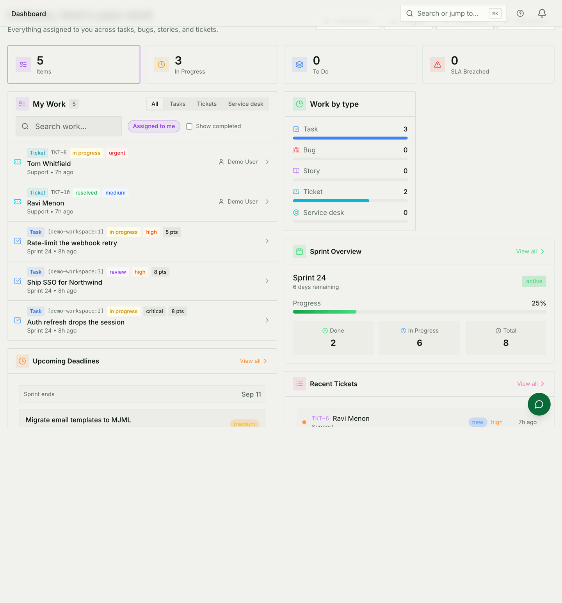
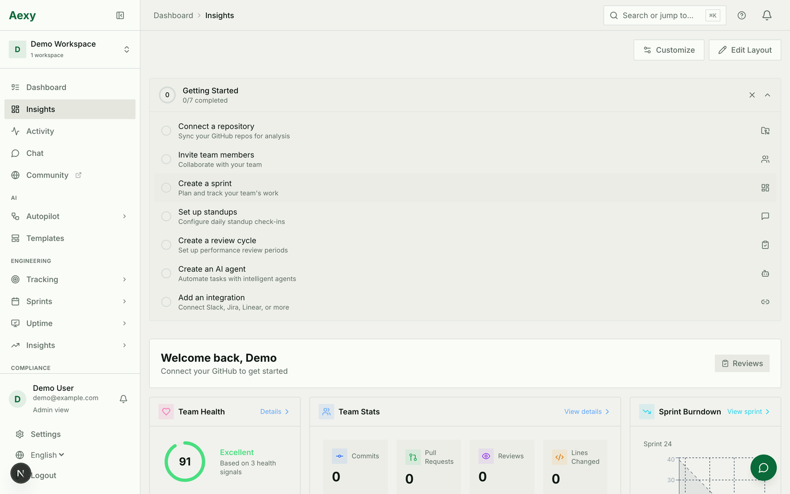
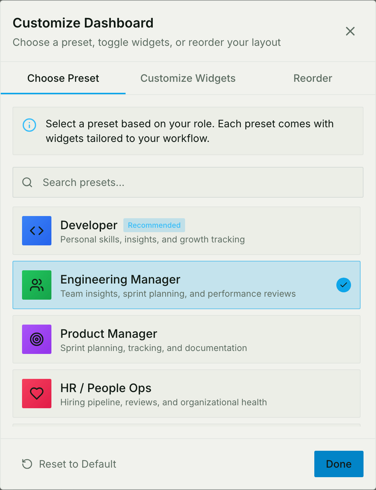

# Dashboard

The first page anyone sees, and the one page nobody can switch off. There are
**two** of them, they answer different questions, and the names have moved
around enough that it is worth being explicit:

| Where | What it answers |
|---|---|
| `/dashboard` | **My Work** — what is on my plate, across every workspace |
| `/dashboard/overview` | **Insights** — a grid of widgets you arrange |

`/tickets` and `/my-work` both redirect to the first one.

## My Work

One list of everything waiting on you — sprint tasks, bugs, stories, form
tickets and Service Desk tickets — with a source filter across the top so you
can look at one kind at a time.

Three controls decide what you are actually looking at, and the defaults are
narrow on purpose:

* **Source** — everything, tasks, tickets, or the service desk.
* **Assigned to me / Everyone's tickets** — starts on yours. Unassigned work in
  a shared queue is not yours yet, so it is not in the default list.
* **Show completed** — off, so finished work is out of the way.

Below the queue, the same work counted by type, an overview of the current
sprint, and what is due soon.

## Insights: the widget grid

A grid you arrange yourself. Widgets come from across the product — team
health, sprint burndown, review cycles, uptime, CRM pipeline — and each one
fetches its own data, so the page fills in piece by piece rather than all at
once.

**Customize** picks which widgets are on the grid; **Edit Layout** moves and
resizes them. Both are per person: arranging your dashboard changes nothing for
anybody else.

You are only offered widgets from apps this workspace has switched on. If a
colleague has one you cannot find, the difference is usually app access rather
than the picker.

### Starting layouts

The first time somebody opens the grid they are asked what they do —
developer, engineering manager, product, HR, support, sales, admin — and the
answer lays out a starting dashboard for that role.

It applies **once**. After that the layout belongs to the person, and changing
roles later does not rearrange what they have built. Picking the "wrong" one is
recoverable in a minute from Customize; it just decides what the product looks
like on day one, which is most of a first impression.

## Common mistakes

- **Sending somebody to "the dashboard" when you mean the widgets.** That is
  `/dashboard/overview`. `/dashboard` is the work list.
- **Concluding the queue is empty.** Check *everyone's* and *show completed*
  before believing it.
- **Expecting your layout to be shared.** It is not a team dashboard. For
  something everybody sees, use a report or a published project view.

## For developers

The grid renders from two config files, neither of which holds data:

- `frontend/src/config/dashboardWidgets.ts` — one definition per widget: id,
  category, default size, and the app it belongs to.
- `frontend/src/config/widgetRegistry.tsx` — maps a widget id to its component.

The split exists so the definition list can be filtered by app access without
importing every widget's code; `getAccessibleWidgets` does that filtering, and
a widget with **no `appId` is visible to everyone**, because "belongs to no
app" reads as "not access-controlled".

Adding one means touching both files, plus `dashboardPresets.ts` for the
starting layouts that should include it, and `HOST_PROP_WIDGETS` if it takes
props from the page instead of fetching its own data — a prop-driven widget
left out of that set renders empty.
