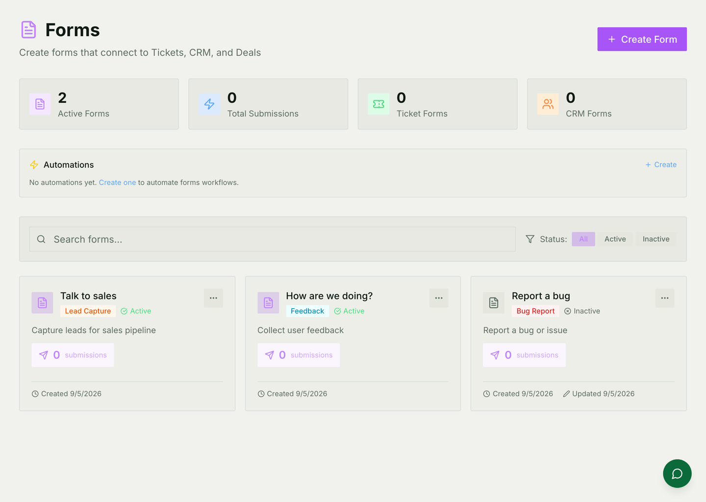
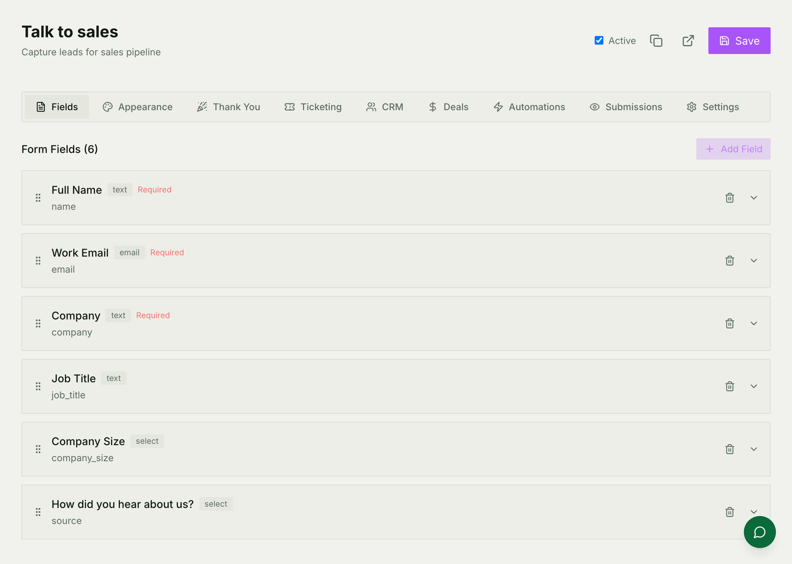
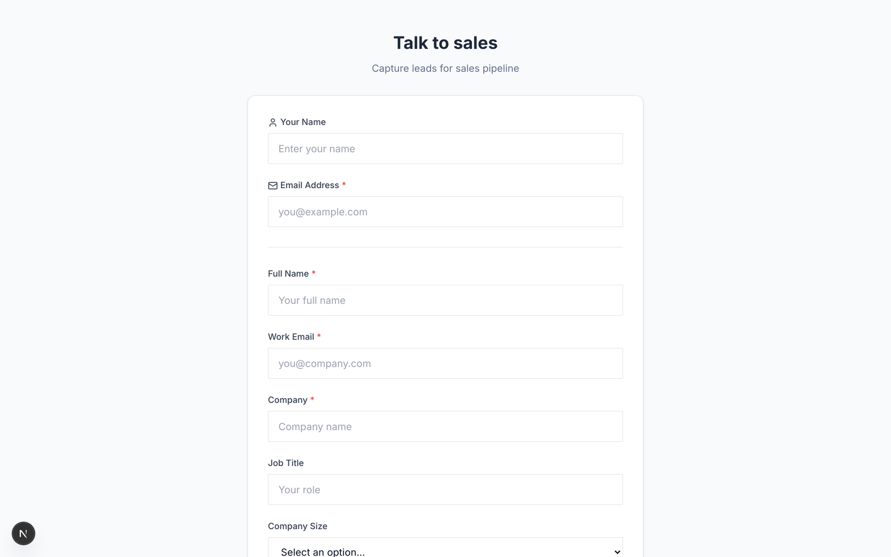

# Forms

Collecting something from people, and deciding what happens to it. A form can
open a ticket, create a contact, start a deal, or simply keep the answers.

For how it is built — the model, the public flow, the builder API — see
[Forms architecture](./forms-architecture.md).

## Starting from a template

Six templates ship: bug report, feature request, support request, contact us,
lead capture and feedback. Each one arrives with sensible fields already on it,
which is usually faster than starting blank and always faster than arguing
about what to ask.

A form is **active** or not. Inactive means the public link stops answering —
which is how you take a form down without deleting the answers it already
collected.

## Building it

Fields are dragged into order; each has a type, a key, and whether it is
required. The tabs across the top are the part worth knowing about, because
they are where a form stops being a survey:

| Tab | What it decides |
|---|---|
| **Appearance** | How the public page looks |
| **Thank You** | What the person sees after submitting, or where they are sent |
| **Ticketing** | Whether a submission opens a ticket, and who gets it |
| **CRM** | Whether it creates or updates a record |
| **Deals** | Whether it starts a deal |
| **Automations** | Anything else that should happen |
| **Submissions** | Everything collected so far |

You can switch on more than one. A lead-capture form that creates a contact
*and* a deal *and* notifies the sales channel is one form with three
destinations, not three forms.

## The public page

Every form has its own link and needs no account behind it. Anyone with the
link can fill it in; the answers arrive in the workspace.

If you need to know the address is real, set the form to verify it — the person
gets a code before their answers are accepted. Weigh it honestly: it stops
rubbish, and it also stops some genuine people.

## Rules that show and hide fields

Conditional rules make the form react — ask about the plan only if they said
they are a customer, and so on.

**A hidden field is not a validated field.** Hiding removes it from the page,
not from what the server will accept. If something must be present, make it
required and give it validation; conditional rules are for the experience, not
for the data.

## When part of it fails

A submission that arrives but whose downstream steps do not all succeed is
recorded as **partially failed** — and the person who submitted it still gets a
success page, because their part worked.

That is the right behaviour and a quiet one: nobody is told that the CRM record
was not created. **Check the submissions list**, which is where the state is
visible, before assuming a form has been working all month.

## Common mistakes

- **Creating tickets with nowhere to send them.** A form that opens tickets
  with no default team leaves them unassigned in the queue.
- **Trusting conditional rules to enforce data.** They do not.
- **Assuming a green page means everything worked.** Partial failures are
  visible only in the submissions list.
- **Deleting a form to take it down.** Switch it inactive; the link stops
  answering and the answers survive.
- **Using a public form for a bulk import.** The public endpoint is rate
  limited per address, deliberately. [Importing your data](./guides/importing-data.md)
  is the other path.
