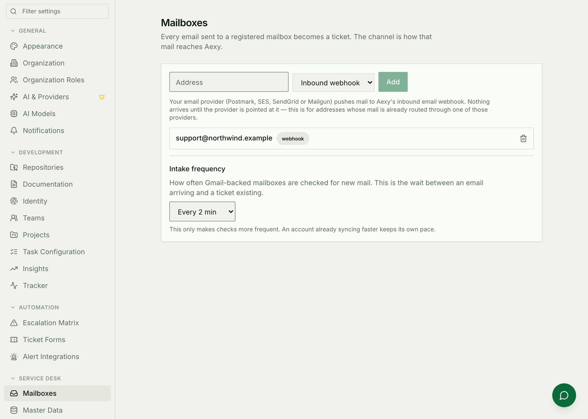
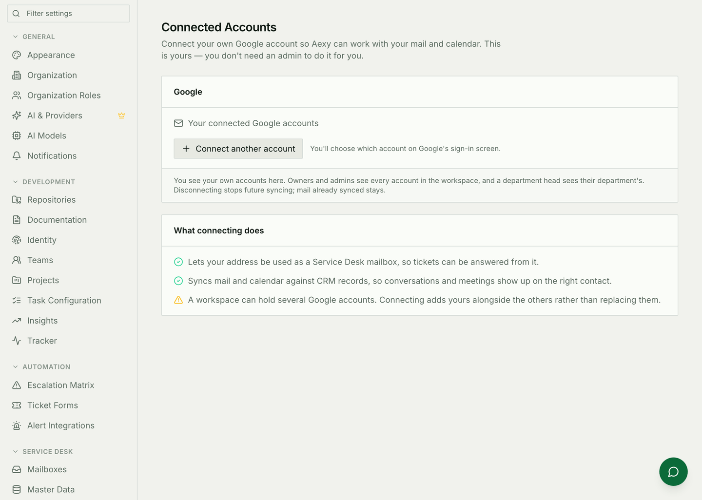
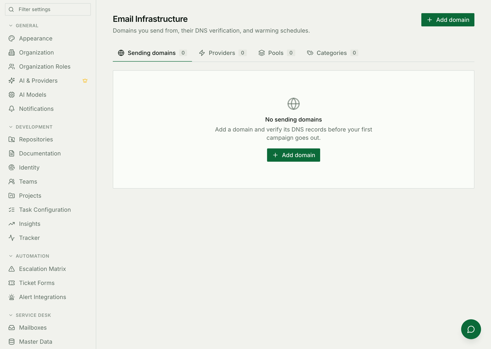

# Email and inbox setup

Mail **arriving** and mail **leaving** are configured in different places, by
different people, for different modules. This is the map.

## Mail arriving

Two channels, and which one you want depends on where the address already
lives.

**Inbound webhook.** Your email provider — Postmark, SES, SendGrid or Mailgun —
is pointed at Aexy's inbound endpoint and pushes each message to it. Use this
when the address's mail already routes through one of those providers.

Registering the mailbox in Aexy is only half of the arrangement. **Nothing
arrives until the provider is actually configured to deliver to the endpoint**,
and a mailbox that has never received anything usually means that half was
skipped.

**Gmail sync.** Aexy reads the inbox through a connected Google account.

**Settings → Connected Accounts** is where somebody connects their own Google
account — it is theirs, not an administrator's job. Connecting is what allows:

* that address to be used as a Service Desk mailbox, so tickets can be answered
  from it;
* mail and calendar to be matched against CRM records, so conversations show up
  on the right contact.

A workspace can hold several connected accounts, and connecting adds yours
beside the others rather than replacing them. Adding a Gmail-channel mailbox is
**refused unless that exact address is connected** — the desk will not claim to
read an inbox it cannot open.

Disconnecting stops future syncing. Mail already synced stays where it is.

### Which module reads which

| Module | What it reads |
|---|---|
| [Service Desk](../service-desk.md) | Registered mailboxes, by either channel — every message becomes a ticket |
| CRM | Connected accounts, to attach conversations and meetings to records |
| Booking | Connected calendars, for availability |

## Mail leaving

**Settings → Email Marketing** is the sending side: the domains you send from,
their DNS verification, the providers behind them, and warming schedules for a
domain that has not sent before.

Verify a domain before the first campaign. Sending from an unverified domain is
how a new domain's reputation is spent in an afternoon.

Transactional mail — a Service Desk receipt, a leave approval, a digest — goes
out through the same infrastructure but is addressed by the module that sent
it. The Service Desk has its own identity setting for the address its replies
appear to come from, because a reply to a customer should not arrive from
`notifications@`.

**Delivery monitoring** — per-message status, bounce tracking and logs — lives
at **Settings → Email Delivery** and needs the Enterprise plan. Without it,
sending still works; you just cannot inspect it after the fact.

## Common mistakes

- **Registering a mailbox and waiting.** The provider has to be pointed at the
  inbound endpoint. Aexy cannot pull from an address it has not been given
  access to.
- **Trying to add a Gmail mailbox for an address nobody has connected.** It is
  refused, and correctly.
- **A connected account whose token has expired.** Syncing stops quietly.
  Reconnecting is the fix, and it is the first thing to check when mail was
  arriving and then stopped.
- **Sending from an unverified domain.** Verify first; warm second; campaign
  third.
- **Expecting a reply to a customer to come from the workspace default.** Set
  the module's own From identity, or your support replies will look like
  notifications.
