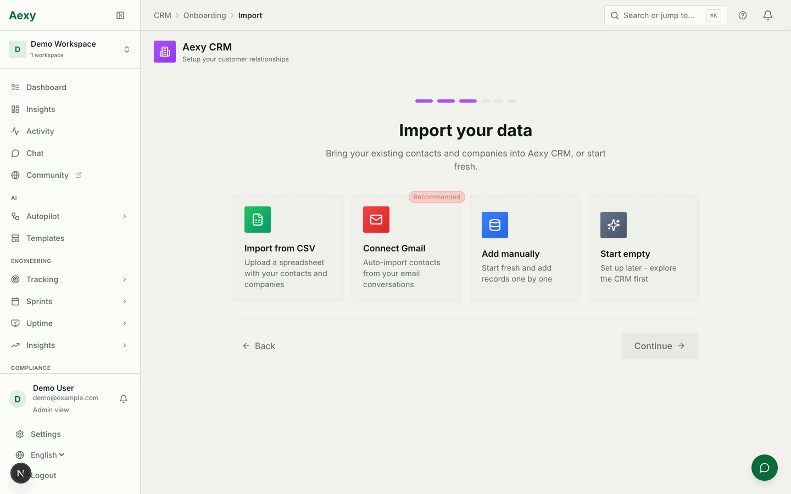
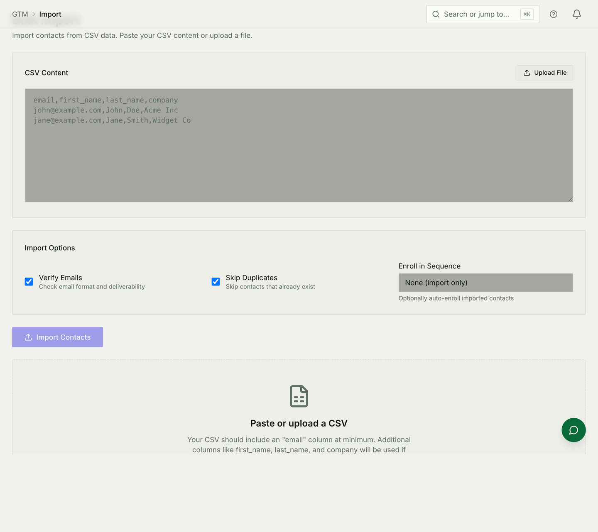

# Importing your data

Arriving with a CRM full of contacts, a wiki full of pages, or a spreadsheet
somebody has been maintaining for three years. Each module takes its own
imports, and one of them has no screen yet — this is the map.

## Contacts and companies



The CRM's setup flow offers four ways to start, and they are all still
available afterwards:

* **From a CSV** — the usual one. Map your columns to fields on the way in.
* **From Gmail** — connect an account and let existing conversations create
  the contacts.
* **By hand** — for a workspace that has a dozen relationships, not a thousand.
* **Empty** — and grow it from forms and inbound email.

## Prospect lists



GTM takes a list rather than a database: paste the CSV or upload the file, and
choose what happens on the way in — verify the addresses, skip contacts you
already have, and optionally enrol everybody imported into a sequence.

The minimum is an `email` column. `first_name`, `last_name` and `company` are
used when they are there.

**Enrolling on import is the setting to be careful with.** It starts sending to
everyone in the file, so import first and enrol deliberately unless you are
certain about the list.

## Documents

**A `.docx` file** can be dropped straight into the knowledge base and becomes
a page. A file already in Drive can be promoted into one.

**A Notion or Confluence export** is imported by archive: Aexy works out which
product it came from, recreates the hierarchy, uploads the attachments, and
rewrites internal links so they point at the new pages. Large spaces run in the
background, pages that will not convert are listed with a reason instead of
failing the whole run, and re-running continues where it stopped.

**There is no screen for it yet.** The import runs, and it is the same code
path a UI would call, but today it is started with an API request:

```bash
curl -X POST \
  -H "Authorization: Bearer $TOKEN" \
  -F "file=@confluence-space.zip" \
  "https://<your-host>/api/v1/workspaces/$WORKSPACE_ID/documents/import?space_id=$SPACE_ID"
```

It answers `202` with a job id; `GET .../documents/import/{job_id}` reports
progress, and `POST .../documents/import/{job_id}/retry` resumes a run that
stopped. Importing needs admin on the destination space, and an archive over
500 MB is refused — that size is a whole Confluence instance rather than a
space, and should be split first.

## Reminders and compliance records

Compliance takes a CSV of recurring reminders — who, what, and how often —
which is how a workspace moves a spreadsheet of certification renewals in
without retyping it.

## What no import will do for you

- **Decide your structure.** Import into a knowledge base with no spaces and
  you get a flat pile of pages. Make the spaces first.
- **Deduplicate against what you have not loaded yet.** Skip-duplicates
  compares against what is *already* there, so the order you import in matters.
- **Fix bad addresses.** Verification flags them; it does not repair them.
- **Preserve permissions.** Nothing carries the source system's sharing rules.
  Whatever you import lands under the destination's own access rules — which is
  usually what you want, and always worth checking before you import a wiki
  that had private corners.
