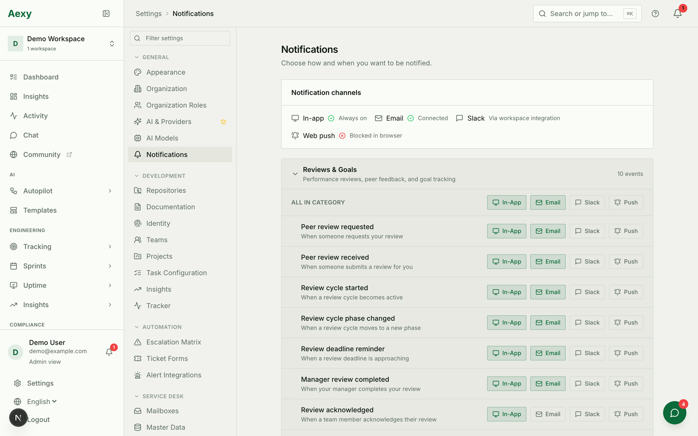

# Notifications and digests

Everything the product sends, and how to stop each of it reaching you. Worth
reading once by whoever set the workspace up, because most complaints about
"too many emails" are one setting away from solved.

## The two different things

They arrive the same way and are configured in completely different places:

* **A notification** is a reaction to something that just happened — somebody
  assigned you a ticket, a review moved on, a monitor went down. Configured
  **per person**, on the settings page below.
* **A digest** is a summary on a schedule, sent whether or not anything
  happened. Configured **per module**, by whoever administers it.

Turning off notifications does not stop a digest, and vice versa. That is the
usual reason somebody thinks they switched everything off and is still getting
mail.

## Notifications: the per-person settings

**Settings → Notifications.** Four channels across the top, then one row per
event with a switch per channel.

| Channel | What to know |
|---|---|
| **In-app** | Always on. It is the bell, and it is the record — the others are copies |
| **Email** | The one people actually mean when they say "too many notifications" |
| **Slack** | Needs the workspace's Slack integration connected |
| **Web push** | Needs the browser's permission; it will say if the browser has blocked it |

Events are grouped by category, and each category has an **all in category**
row — which is how you turn off, say, every review notification by email
without touching the eleven switches underneath.

Two things worth saying to a team that is drowning:

* **In-app cannot be switched off**, and should not be. It costs nobody
  anything and it is where the history lives.
* **Turn off a channel, not an event.** Somebody who silences "peer review
  requested" entirely will miss the one that mattered; somebody who turns off
  its *email* still sees it in the bell.

## Digests: the per-module schedules

Each of these is configured by an administrator in the module that owns it, and
each has its own recipients:

| Digest | Where it is configured | What it carries |
|---|---|---|
| **Service Desk digest** | Service Desk → Digest | Open tickets — each person's own, and the desk lead's everything |
| **Daily reminder digest** | [Compliance](../compliance.md) | What is due and what is overdue |
| **Weekly AI digest** | Workspace AI settings | A summary of the week's activity |
| **Feedback digest** | [Reviews](../reviews-and-people.md) | Feedback collected since the last one |
| **Scheduled reports** | The report itself | Whatever that report returns |

Two of these deserve care because they cross a boundary:

* **The Service Desk digest's additional recipients** get the *whole desk's*
  open tickets — subjects and account names included. That is somebody outside
  the desk reading customer correspondence titles every morning.
* **A scheduled report keeps arriving** at whoever is on its list, long after
  the person who asked for it has moved on.

## Reminders and escalations

Compliance and reminders escalate rather than repeat: the person, then their
manager, then whoever owns the obligation. Configure the ladder deliberately —
an escalation that starts at the top is one everybody learns to ignore, and an
escalation with no ladder at all is a reminder that nobody has to act on.

Booking, review deadlines and work-item deadlines each send their own reminders
close to the date. They are not in the digest settings because they are not
digests; they are notifications with a timer.

## When somebody says they get too much

In order, because it is usually the first one:

1. **Which channel?** Almost always email. Turn off the category by email and
   leave in-app on.
2. **Is it a digest?** Then it is a module setting, not theirs — and somebody
   may have added them as an additional recipient.
3. **Is it an escalation?** Then something is genuinely overdue, and the mail is
   working. Fix the obligation, not the notification.

## Common mistakes

- **Switching off notifications and expecting the digests to stop.** Different
  system, different setting, different administrator.
- **Silencing an event across all channels** because email was noisy.
- **Adding a manager as an additional digest recipient** without noticing they
  now receive every customer's subject line.
- **Treating an escalation as noise.** It is the one message in this document
  that means something is wrong.
