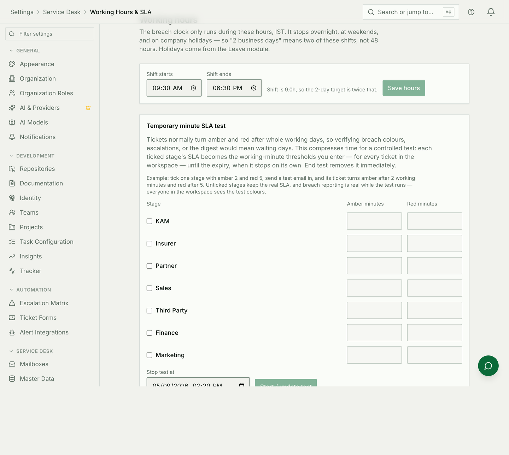

# Working hours, holidays and the clocks

Two modules measure elapsed time, and they read the same calendar. Configuring
one and not the other is how a workspace ends up with a service desk that
breaches targets on Diwali.

## The shift

The Service Desk's turnaround clock accrues **only inside the shift**, in the
workspace's own timezone. Nothing accrues overnight, at weekends, or on a
holiday.

That has a consequence people find surprising the first time: **"2 working
days" is 18 hours on a 09:30–18:30 shift**, not 48 hours of wall clock. A
ticket that arrives on Friday afternoon is not breaching on Sunday morning, and
it should not be.

The timezone is not decoration. Whether an instant falls inside Tuesday's shift
depends entirely on which timezone you ask in, and getting it wrong shifts
every figure the desk reports.

## The calendar

Holidays live in **Leave**, and there is exactly one list. The Service Desk
reads it; it does not keep its own.

Two rules to know when adding one:

* **Mandatory, workspace-wide holidays stop both clocks.** A leave request
  spanning one does not spend a day of somebody's balance, and a ticket does
  not age.
* **Optional holidays stop neither.** They are days people *may* take, not days
  the organisation is closed — so they reduce nobody's day count and pause no
  turnaround.

A holiday aimed at particular teams is likewise not a workspace-wide closure,
and the desk's clock ignores it.

## Which clock is which

A Service Desk ticket carries two numbers, and they disagree on purpose:

| Figure | Measured in | Why |
|---|---|---|
| **Overall TAT** | Wall clock, weekends included | The requester really did wait through the weekend |
| **Current stage** | Working time on the shift | It is what the breach target is measured against |

A dashboard cell turns red on the second one. A customer complaining about the
first is not wrong.

## Common mistakes

- **Configuring the shift and forgetting the holidays.** The clock then runs
  through every public holiday in the year.
- **Adding holidays as optional** because it seemed safer. Optional stops
  nothing.
- **Changing the timezone after a quarter of reporting.** Every historic figure
  was computed in the old one; the numbers move.
- **Expecting a holiday added today to change a request approved last week.**
  Day counts are computed when a request is made.
- **Assuming the desk has its own calendar.** It does not. If the desk is
  wrong about a holiday, fix it in Leave.
