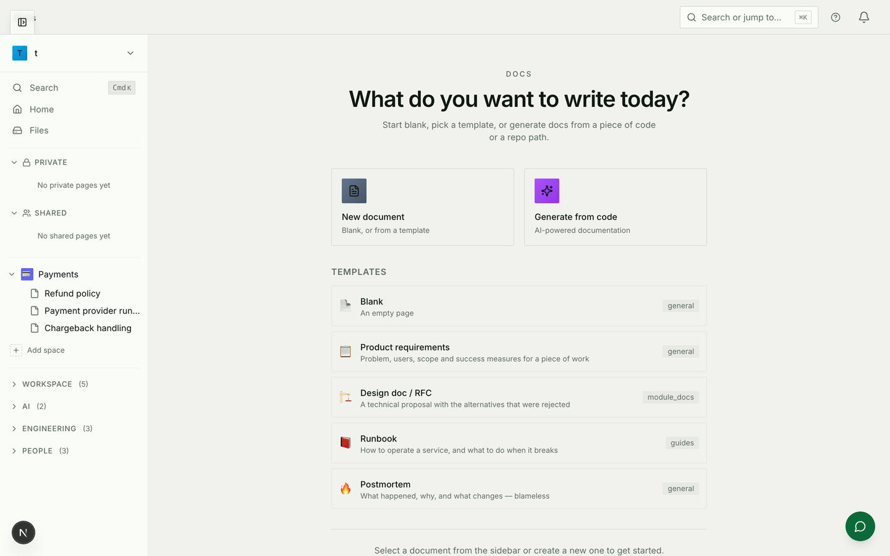
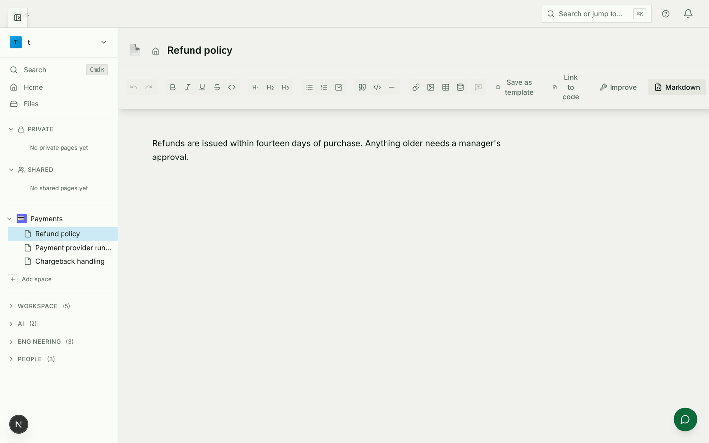
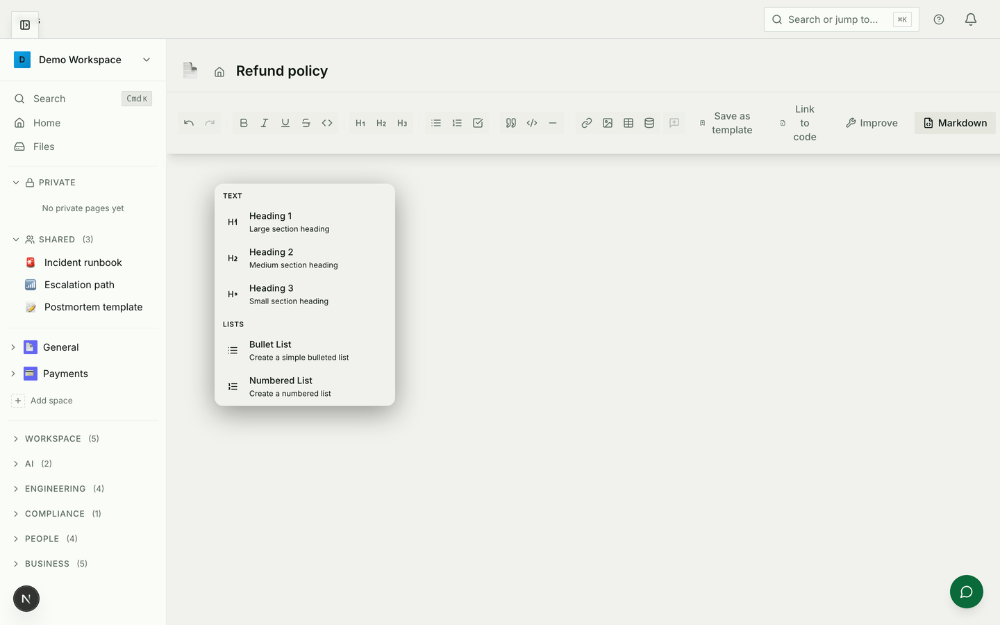
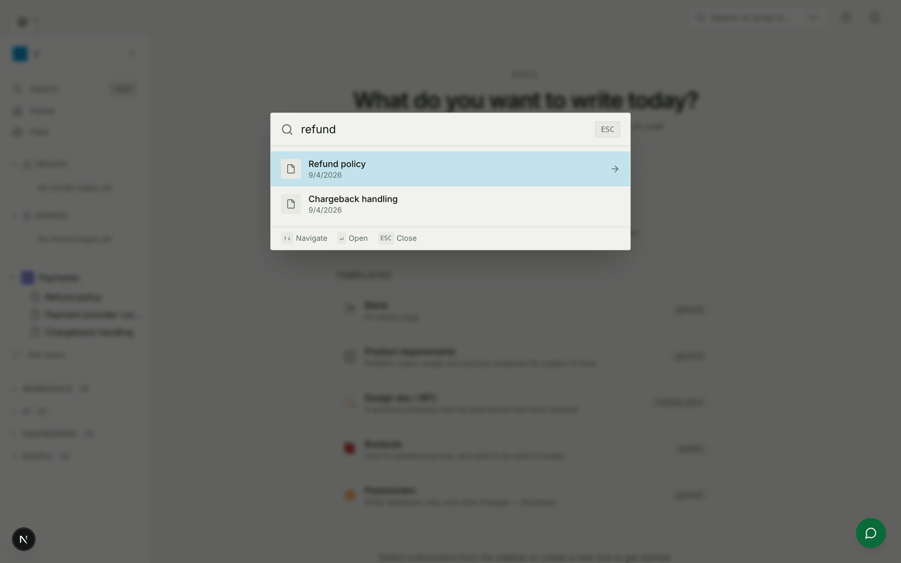
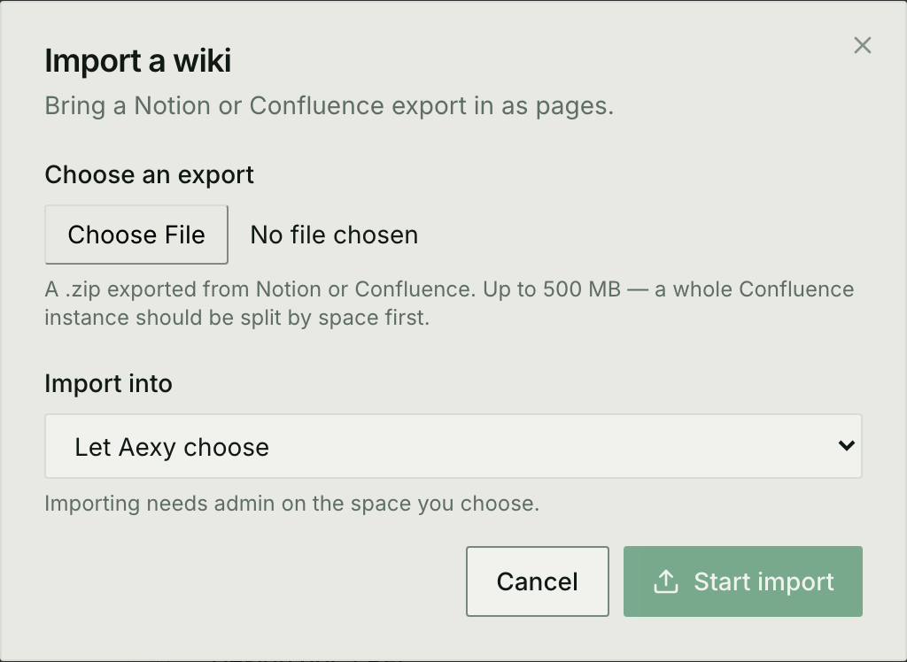

# Knowledge base

How to build a knowledge base in Aexy, and — the harder part — how to keep it
true after the first month.

This is the guide for running one. If you are changing the code behind it, read
[Documents, Drive & Knowledge Graph](./documents-and-drive.md) instead.

---

## Spaces and pages

A **space** is a section of the knowledge base: *Engineering*, *Payments*,
*People*. A **page** lives in a space and can nest under another page, so a
runbook can carry its own sub-pages without cluttering the top level.

Two things about spaces are worth deciding early, because changing them later
means moving pages around.

**Who a space is for.** A space is either **open** — every member of the
workspace can read and write in it — or **restricted**, meaning exactly the
people on its member list, at the role their row gives them: viewer, editor or
admin. Restricted is what you want for anything with salary, legal or security
in it.

**Whether changes are reviewed.** A space can require that edits are approved
before they are published. See [Review before publishing](#review-before-publishing);
it has a trade-off attached.

> A page marked **private** stays private even in an open space. Being a member
> of the space it happens to sit in is not consent — the space is where a page
> is filed, not who it is for.

---

## Writing a page

The editor is a rich-text editor with the usual formatting, and pages save as
you type.

There is also a **slash menu**: type `/` on an empty line to insert a heading,
list, task list, quote, code block, divider, table, image or database view
without leaving the keyboard. The menu scrolls; the screenshot shows the top of
it.

There is no save button, and nothing is lost if you close the tab.

### Word documents

A `.docx` uploaded to the knowledge base stays a Word document — Aexy does not
convert it to a lossy approximation. It keeps its formatting, is searchable
like any other page, and downloads as the file it always was. It is edited
through its own editor rather than the rich-text one, because the two bodies
would otherwise disagree about which is real.

---

## Working together

Several people can edit the same page at once. You see their cursors as they
type, and their changes as they make them.

This is genuine collaborative editing: the server holds the document, so
somebody who opens the page while nobody else is there still gets the merged
result, and an edit made as the last person closed their tab is not lost.

**Comments** attach to a passage rather than to the page. Highlight text, leave
a comment, and it stays anchored to that passage as the document changes around
it. Threads resolve when they are dealt with.

> Live editing is off in spaces that require approval — see
> [Review before publishing](#review-before-publishing).

---

## Keeping it current

This is where most knowledge bases fail. Aexy gives you four mechanisms; they
solve different failures, and you probably want more than one.

### An owner and a review date

`Created by` records who typed a page, which stops being the right answer the
moment they change team. **Owner** is who is accountable for it *now*, and is
who review reminders go to.

Set a **review date**, and when it passes the page appears in the review queue.
The owner opens it, checks it, and marks it **verified** — which records that
somebody confirmed it and rolls the next review forward.

Marking a page verified is deliberately separate from editing it. Most pages
that need confirming need no change, and a system that only records freshness
as a side effect of editing gives people a reason to make pointless edits.

### The review queue

Everything overdue, most overdue first. Pages with no owner are listed too, and
last — they are the ones that rot, precisely because nobody gets the reminder.

### Pages that follow code

A page can be **linked to files or directories in a repository**. When that code
changes, Aexy notices the page may be behind and offers an update. Each link has
a sync mode:

| Mode | What happens when the code changes |
|---|---|
| **Propose** | The update is queued for review. The default, and the only safe setting for a page anyone wrote by hand. |
| **Auto** | The update is applied without asking — only ever when it was derived from the existing prose, never when regenerated from scratch. |
| **Off** | Stop watching. The page also stops being reported as behind, so the badge does not become noise. |

A page that has fallen behind its code carries a badge in the sidebar, so you
see it while browsing rather than only after opening it.

### Version history and trash

Every change is a version. Open the history, compare, and restore any earlier
state; a version you restore from is kept permanently.

Deleting a page moves it and its sub-pages to the **trash** rather than
removing them, and nothing is destroyed until the retention window passes.

> **Restoring is not in the interface yet.** The page is recoverable — it is
> still there, flagged as deleted — but reaching it currently needs the API
> (`GET /documents/trash`, `POST /documents/{id}/restore`) or an administrator.
> Until the screen lands, treat delete as *hard to undo* rather than easy.

---

## Review before publishing

A space can require that every edit is approved before it becomes the live page.
An edit by somebody who is not a space admin becomes a **proposal**: the author
sees the page unchanged, a reviewer sees a diff, and the change lands only when
they approve it.

- Proposals are **addressed to a reviewer**, not left in a queue hoping.
- **You cannot approve your own** — the point of the gate is a second reader.
  A workspace can allow it if it genuinely wants the record without the review.
- Two people proposing changes to the same page **do not overwrite each other**.

**The trade-off, stated plainly: a space that requires approval does not get
live collaborative editing.** Co-editing writes to the page continuously, which
would walk straight past the gate — and a gate people can step over by opening
the editor is worse than no gate, because it is believed. In these spaces the
editor saves the ordinary way and each save becomes a proposal.

So: use approval for policies, contracts and anything audited. Leave it off for
the pages people write together.

---

## Finding things

Search covers page titles and their contents, ranked by relevance rather than
by date, and each result shows the passage that matched with your terms
highlighted. Press `Cmd`/`Ctrl` + `K` anywhere in the knowledge base.

It is **keyword and meaning together**. A search for *"how do we handle angry
customers"* finds the escalation policy even if it never uses those words,
because pages are also indexed by meaning. Exact terms still win where they
exist — the two are combined, not chosen between.

Search only ever returns pages you can already open. A page you have no access
to does not appear, and does not appear as a hidden result either.

---

## Sharing outside the workspace

A page can be **published** to a public portal, readable without an Aexy login,
at `/kb/<page-name>`. Publishing is a workspace-admin action.

**Publishing takes a snapshot.** The public copy does not follow later edits.
That is deliberate: a published page that silently mirrored its source would
mean an accidental edit to an internal document became instantly public, made by
somebody who did not know the page was externally visible. When the source
moves on, the page is flagged as behind and you republish when you mean to.

Articles can also be published to a **workspace audience** instead — readable by
signed-in members, invisible to everyone else. Useful for a company handbook
that should not be on the open internet.

---

## Bringing content in

### From Notion or Confluence

Export your space from either product, then **Import a wiki** in the documents
sidebar.

Aexy works out which product it came from, recreates the page hierarchy,
uploads the attachments, and **rewrites internal links so they point at the new
pages** — a migrated wiki whose links 404 is worse than no migration.

Pick a destination space, or let Aexy choose one. Either way you need **admin
on the space it lands in**: the import creates pages in bulk, and edit rights
are not enough to fill somebody else's space.

A large space takes a while, so it runs in the background with a progress
count. **Closing the dialog does not stop it** — the pages appear in the
sidebar as they arrive.

Pages that do not convert cleanly are listed with a reason rather than failing
the whole import. That end state is *imported, with pages skipped*, and it is
not a failure: one page with a table nothing can convert must not roll back the
four thousand that came in fine.

An import that stops can be resumed, and resuming continues where it stopped
rather than starting again — so a retry does not produce a second copy of
everything that already arrived.

Importing needs admin access to the destination space.

### From files

Drop a `.docx` in directly, or promote a file already in Drive into a page.

---

## Taking content out

Any page exports as **Markdown, HTML, PDF, or its raw JSON**. A whole space
exports as a zip with folders mirroring the page hierarchy.

The export contains what you can read: a bulk export is a read of every page in
it, and is filtered accordingly.

> **PDF and non-Latin scripts.** Hindi, Arabic, Hebrew, Thai and other scripts
> that reshape or join their characters export correctly: the text is shaped
> before it is drawn, so vowel signs sit where they belong, conjuncts stay
> joined, and right-to-left runs come out right to left.
>
> Two things can still go wrong, and the export says so on the page rather than
> leaving you to notice:
>
> * **A glyph the font does not have** — the page names the script and the
>   characters cannot be drawn.
> * **Shaping unavailable** — a deployment without the text shaper falls back
>   to drawing characters individually, which is the old behaviour and is
>   wrong for those scripts.
>
> If either warning appears, **export as Markdown or HTML for a faithful
> copy**; those formats keep the text exactly as written.
>
> Nothing needs configuring in the shipped Docker image: it carries a font
> covering Latin and Devanagari, and the shaper is a dependency. Running
> outside Docker, an administrator points `AEXY_PDF_FONT_DIR` at a directory
> holding a font that covers the script, or non-Latin pages export blank.

---

## Who can see what

Access is resolved in this order. The first rule that grants access wins.

| | Can read | Can edit | Can share |
|---|---|---|---|
| Workspace owner / admin | everything | everything | everything |
| Page creator | own pages | own pages | own pages |
| Named collaborator | per their grade — view, comment, edit or admin | | |
| Space member (restricted space) | per their space role | | |
| Workspace member (open space) | ✅ | ✅ | ✗ |
| Workspace viewer | ✅ | ✗ | ✗ |
| Not a member | ✗ | ✗ | ✗ |

Two consequences worth knowing:

- **A private page is not readable by colleagues**, including in an open space,
  unless you share it with them by name.
- **A restricted space is exactly its member list.** Being in the workspace is
  not enough.

Every read, every sharing change and every visibility change is recorded in an
audit trail that administrators can review and export — including who opened a
page and from where.

---

## Analytics

Per page: views, unique readers, and when it was last opened.

Per workspace: the most-read pages, and — more useful — the pages **nobody has
ever opened**. A knowledge base's real problem is rarely its popular pages; it
is the fifty nobody reads that people are still being asked to keep up to date.

---

## A suggested setup

For a team starting from nothing:

1. **Three or four spaces, not twenty.** *Engineering*, *People*, *Customers*.
   Spaces are cheap to add and expensive to reorganise.
2. **Restrict the one that needs it** — usually People — and leave the rest open.
   Restricting everything teaches people to work around it.
3. **Give every page an owner as you create it.** Retrofitting ownership across
   two hundred pages is a project; doing it one page at a time is free.
4. **Set review dates on the pages that go stale dangerously** — runbooks,
   on-call procedures, anything with a number in it. Not on everything, or the
   queue becomes noise.
5. **Link the pages that describe code to that code.** Leave sync on *propose*.
6. **Turn on approval only where it is genuinely needed**, remembering it turns
   off live co-editing for that space.
7. **Check the never-read list after a month.** It will tell you what to delete.
