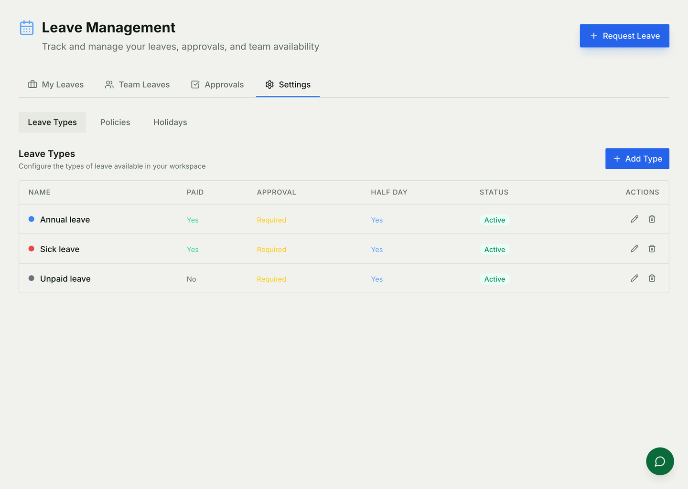
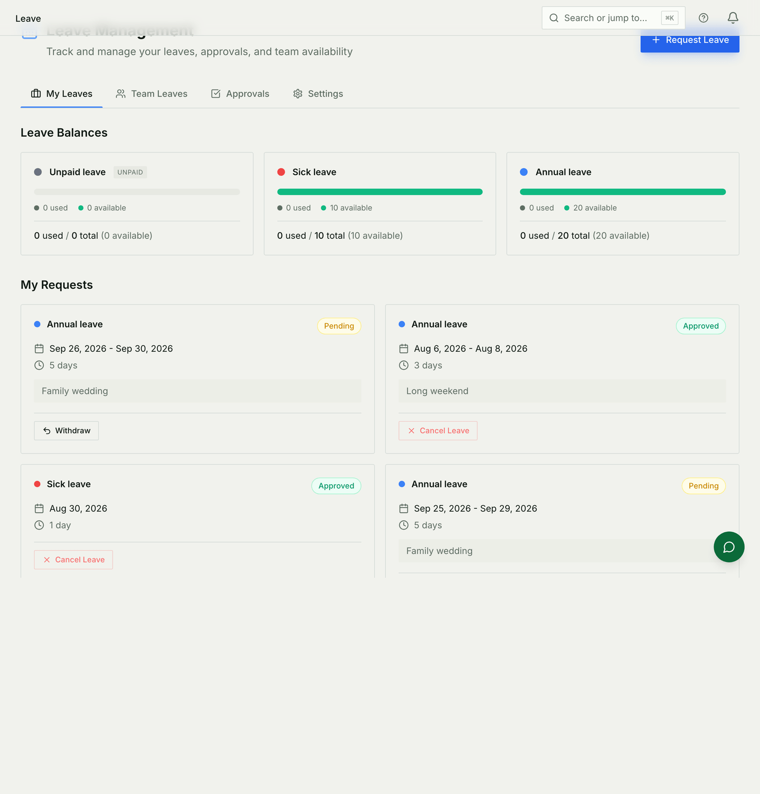
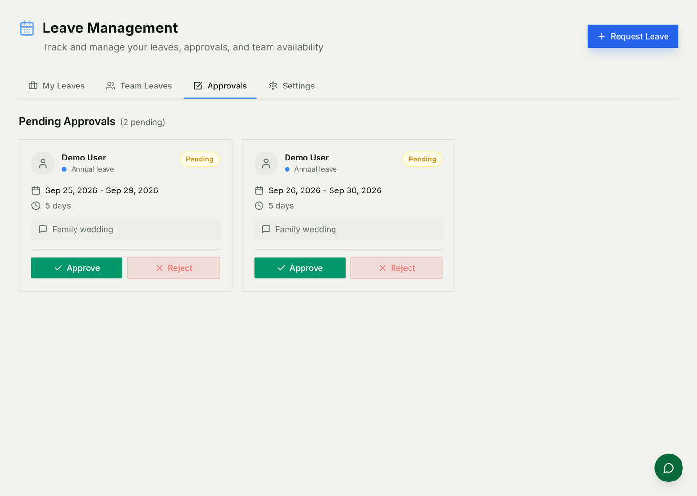

# Leave

Time off: what kinds exist, how much of each somebody gets, who approves it,
and which days do not count because the office was shut anyway.

For how it is built — endpoints, models, the carry-forward job — see
[Leave architecture](./leave-architecture.md).

## Setting it up

Three things to configure, in this order, under **Settings** on the Leave page:

**Leave types.** What somebody can ask for — annual, sick, unpaid, whatever
your organisation actually has. Each one decides whether it is paid, whether it
needs approving, whether half days are allowed, and how much notice is
required.

**Policies.** How much of a type somebody gets in a year, and whether the
unused part carries into the next one. A policy can be aimed at particular
roles or teams; somebody matched by more than one gets the **most permissive**
quota, so overlapping policies are worth being deliberate about.

**Holidays.** The days the whole organisation is off. These matter beyond this
module: a five-day request spanning two holidays counts as three days against
the balance, and — because the Service Desk's turnaround clock reads the same
calendar — a desk ticket does not age on a public holiday either.

Mark a holiday **optional** when it is a day people may take rather than one
the organisation closes. Optional days do not stop either clock.

## Balances

A balance is a row, per person, per type, per year — not something a policy
implies. If the page says there are no balances yet, the year has not been
initialised, which is a setup step rather than a bug.

Booking against a balance happens on **approval**, not on request, so a pending
request does not quietly reserve days somebody may not get.

## Asking for time off

Pick a type, pick dates, say why if it helps. Half days are allowed where the
type permits them, and two half days on the same day of *different* types both
succeed — each takes half from its own balance.

A request that needs no approval is approved as it is made. Everything else
waits.

The requester has two ways out, and they are not the same thing:

* **Withdraw** — a pending request, never approved. Nothing was ever taken from
  the balance.
* **Cancel** — an approved request being given back. The days return to the
  balance.

## Approving

Requests waiting on you, with who asked, for what, and for how long. Approving
writes the days against the balance; rejecting does not.

Approved leave is not only a record: it blocks the dates on the team calendar,
so the days show up when somebody schedules a meeting or looks at who is around
next week.

## Common mistakes

- **Expecting a policy to create balances.** It sets the quota; the balances
  for a year are rows that have to exist.
- **Overlapping policies.** Role-based *and* team-based can both match, and the
  larger quota wins. That is the rule, but it is rarely what somebody intended.
- **Adding a holiday mid-cycle and expecting old requests to change.** Day
  counts are computed when the request is made. Existing requests keep the
  number they were approved with.
- **Marking a real closure as optional.** An optional holiday does not reduce
  anybody's day count and does not pause the service desk clock.
- **Confusing cancelled with withdrawn** when reconciling balances. One returns
  days; the other never took any.
- **A missed year rollover.** Carry-forward runs once at the year boundary. If
  it was missed, balances do not carry until it is run.
