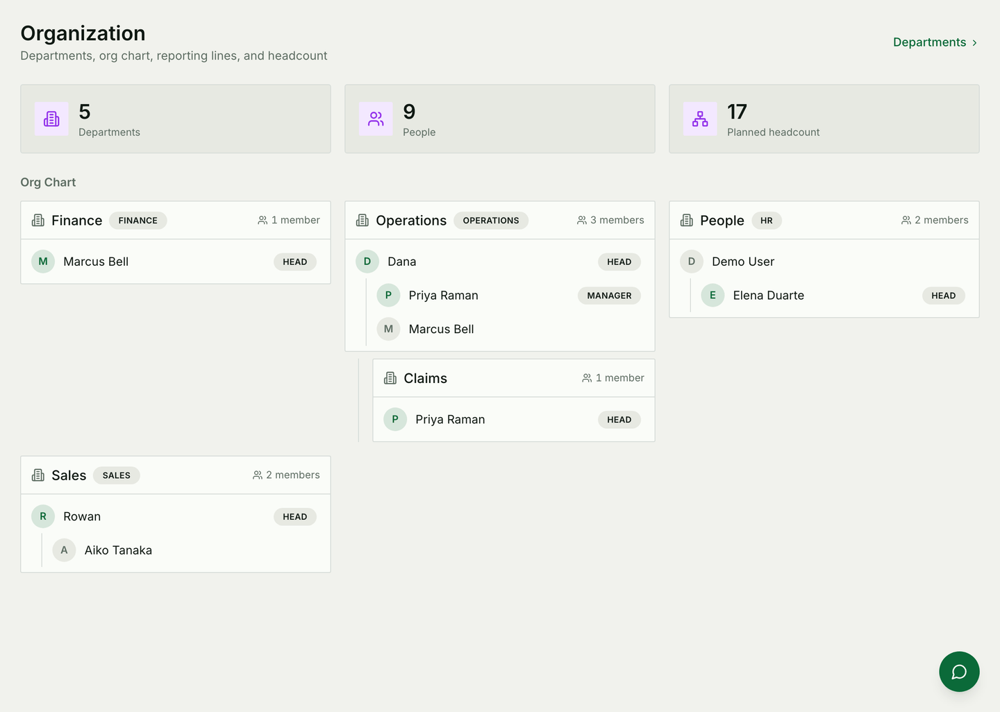
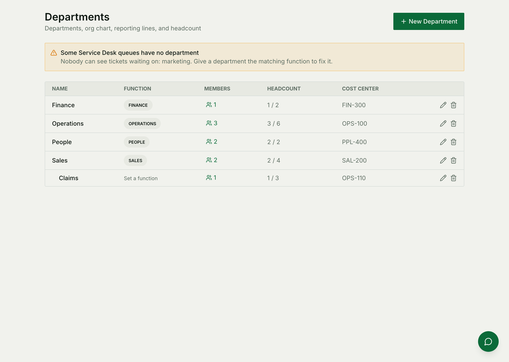
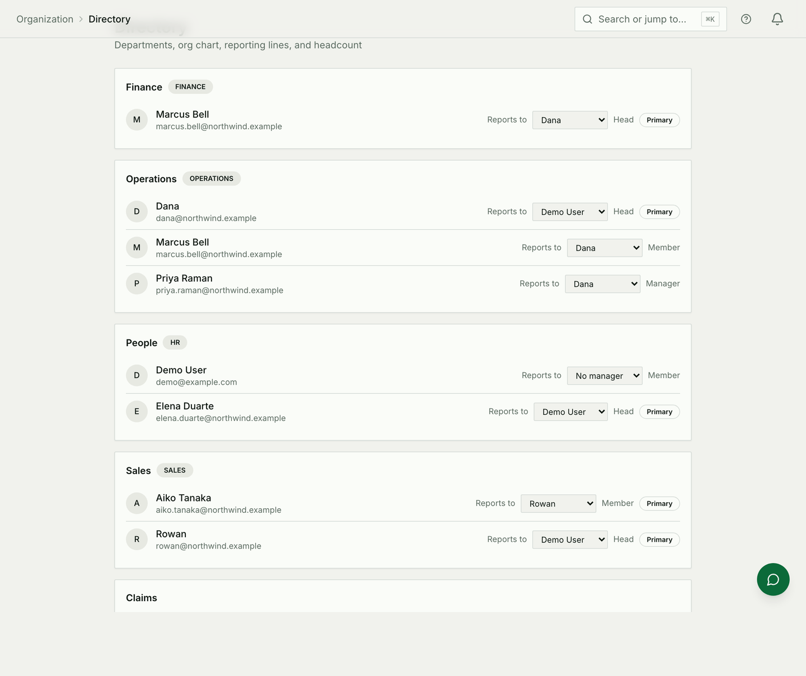

# Organization

Who works here, where they sit, who they report to, and what each of those
facts switches on elsewhere in the product. It is the module other modules
quietly depend on: the Service Desk decides who may see a ticket from it, app
access is granted through it, and the directory is only as complete as it is.

For how it is built — endpoints, the tree, access resolution — see
[Organization architecture](./organization-architecture.md).

## Departments are not teams

Both exist and they answer different questions. Getting them confused is the
main way to get lost here.

| | Department | Team |
|---|---|---|
| Shape | A **tree** — a department can sit inside another | A flat group |
| Answers | Where someone sits, and who they report to | Who works on this together |
| Grants app access | **Yes** | No |
| Owns on-call rotations | No | **Yes** |

A person is normally in exactly one department and any number of teams. Putting
somebody in a team does not place them in the organization, and it is
completely normal for a rotation and a sidebar to disagree.

## Building the structure

A department is a name, an optional parent, and a handful of facts you may or
may not care about: a head, a cost center, planned headcount, a location and a
timezone. Only the name is required — fill in the rest when somebody asks a
question that needs it.

Nesting is a real hierarchy, not a label: Claims inside Operations means the
org chart draws it there, and moving Operations moves Claims with it.

**Two rules the module will enforce rather than warn about:**

* A department with children cannot be deleted. Move the children out first —
  the refusal is protecting the people underneath.
* A department cannot be moved beneath its own descendant. The check walks the
  proposed parent's ancestry, so a cycle is rejected before anything moves.

### The function is the part with consequences

Each department can claim a **function** — Operations, Sales, Finance, People,
Engineering and so on — and a function belongs to exactly one department in the
workspace.

This is not a label. It is how other modules find the department responsible
for something. A Service Desk pending-with bucket owned by "Operations" grants
its tickets to whichever department claims the operations function; if no
department claims it, the desk shows *No department* against that bucket and
the people who work those tickets cannot see them.

If a queue looks empty to the people who staff it, this is the first thing to
check.

## Putting people in it

Somebody joining the workspace is **not** placed automatically. An invitation
can carry a department, and the directory shows who is not in one — that group
is worth keeping empty, because a person with no department is invisible to
everything that reasons about departments.

Within a department a person is a **member**, a **manager**, or the **head**.
The head is the single person the department answers for; managers are for
structure inside a large department; everybody else is a member.

Somebody can belong to more than one department — a person splitting their time
between Operations and Claims is a supported arrangement, not a workaround. One
of their memberships is marked **primary**, which is the one the directory
files them under.

### Reporting lines

Set on the person, not the department, because a reporting line survives a
move. The directory's *reports to* picker offers anyone active in the
workspace, and refuses two things outright: reporting to yourself, and any
choice that would close a loop.

Reporting lines and department heads are related but independent. Somebody can
report to a manager in another department, and often should.

### Open seats

A position is a *seat*, with a title and a status, and a vacant one is a real
row rather than an absence. That is what makes planned headcount mean something
before anybody is hired, and it is what Hiring opens a requisition against.

The org chart shows members against planned headcount, which is the number most
people are actually looking for when they open this module.

## What a department switches on

**App access.** A department carries an access profile — a named bundle of
apps. Put somebody in Engineering and they get the engineering bundle; move
them to Sales and their sidebar changes. Somebody in no department falls back
to their workspace role, which is a valid state and the usual reason two
colleagues see different navigation.

**Service Desk visibility.** Covered above, and worth repeating because it is
the one that produces support tickets: the desk grants a ticket to the
department that owns its pending-with bucket.

**Reparenting is not cosmetic.** Moving a department under a different parent
re-resolves access for everyone underneath it. The drag is cheap; what it
triggers is not.

## Common mistakes

- **Nobody was ever placed.** The invitation went out, the person signed in,
  and no department was chosen. Everything downstream then behaves as though
  they are not in the organization — because they are not.
- **Two departments wanted the same function.** A function belongs to one
  department. The second claim is refused, not silently merged.
- **A department was created but given no function**, and the module that needs
  it goes looking, finds nothing, and shows an empty state that looks like a
  quiet day.
- **Expecting teams to grant access.** They do not. Teams own on-call and
  shared work; departments own access and structure.
