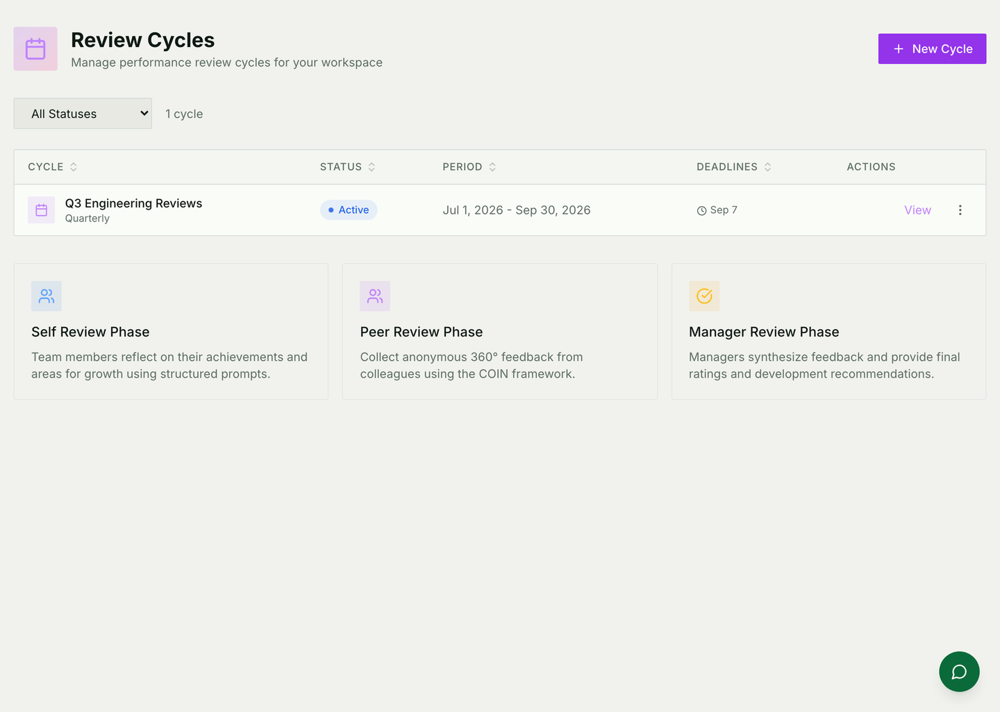
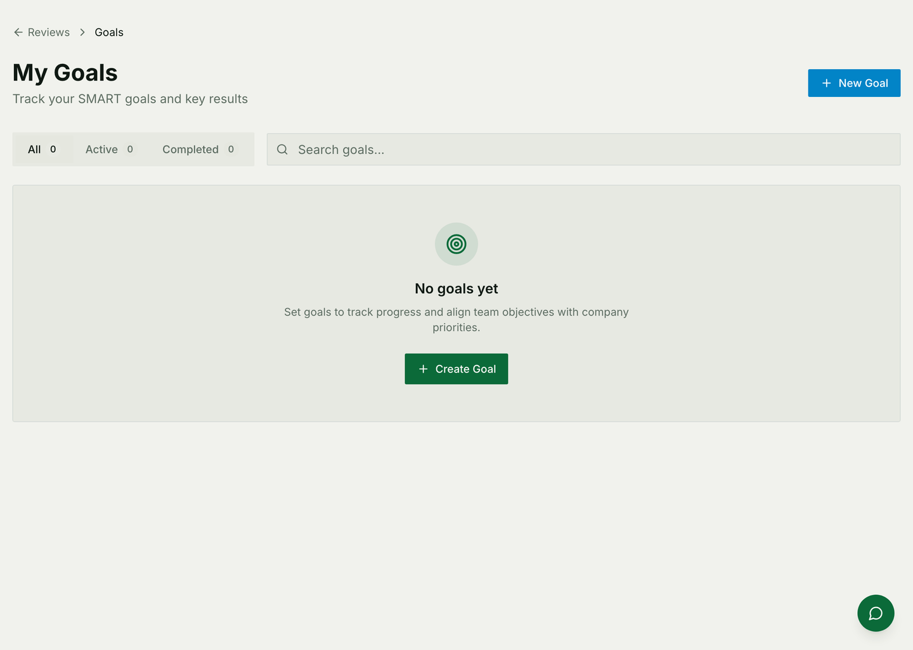

# Reviews, hiring & learning

Three modules about people rather than work: how somebody is doing, who you
hire next, and what they learn along the way.

For how they are built — models, AI usage, external integrations — see
[People architecture](./reviews-and-people-architecture.md).

## Performance reviews

A **cycle** is a review period with three deadlines, one per phase, and every
person in scope gets their own review inside it.

Each review moves through the phases in order:

1. **Self review.** The person reflects on the period against structured
   prompts.
2. **Peer review.** Colleagues give 360° feedback.
3. **Manager review.** The manager synthesises it into ratings and
   recommendations.
4. **Acknowledged.** The person has read it.

A review does not advance because a date passed — it advances because the phase
before it was submitted. The deadlines are what people are held to, not what
the system enforces.

### Who reviews whom

Peer reviewers are chosen in one of three ways, set on the cycle: the subject
picks their own, the manager assigns them, or either is allowed. There is no
right answer, but there is a wrong one — changing the mode mid-cycle leaves
half the reviews assigned one way and half the other.

### Two things to tell people honestly

**Anonymous is not untraceable.** Peer reviews are shown without a name, but
timing and volume can narrow a small team down to one person. If anonymity
genuinely matters, wait until several reviews are in before sharing them with
the subject.

**The AI summary is written once**, when the review completes. A manager who
edits their submission afterwards does not get a new summary automatically.

## Goals

What somebody is working towards, tracked between review cycles rather than
invented during one. A goal carries its own progress, and a review can point at
it — which is what stops the self-review phase becoming an exercise in
remembering July.

## Hiring

Requisitions, candidates, and assessments — including automated ones with a
**trust score** on each attempt.

That score is **advisory**. A low one flags the attempt for a human to look at;
it does not fail the candidate and should not gate an offer on its own. Anybody
using it as a threshold has misunderstood what it measures.

Hiring connects back to [Organization](./organization.md): an open position on
a department is a real row, and a requisition can be opened against it, so
headcount planning and hiring are looking at the same number.

## Learning

Skills, career roles and learning paths — a path is generated from the gap
between somebody's skills and the ones their target role requires.

Two consequences worth knowing:

* **A role's required skills are the target.** Re-weight them and every active
  path derived from that role is stale until it is regenerated. Nothing tells
  you; the paths simply describe an older version of the job.
* **External course progress needs a connected integration.** Naming a course
  as coming from an external provider does not fetch anybody's progress from
  it. Without the integration, completions are self-reported, which is a
  perfectly good answer as long as everybody knows that is what they are
  looking at.

## Common mistakes

- **Treating deadlines as gates.** They are dates in a plan; the phases advance
  on submission.
- **Promising anonymity a small team cannot have.**
- **Reading a trust score as a verdict.**
- **Re-weighting a career role and leaving the paths alone.**
- **Expecting an edited manager review to regenerate its summary.**
