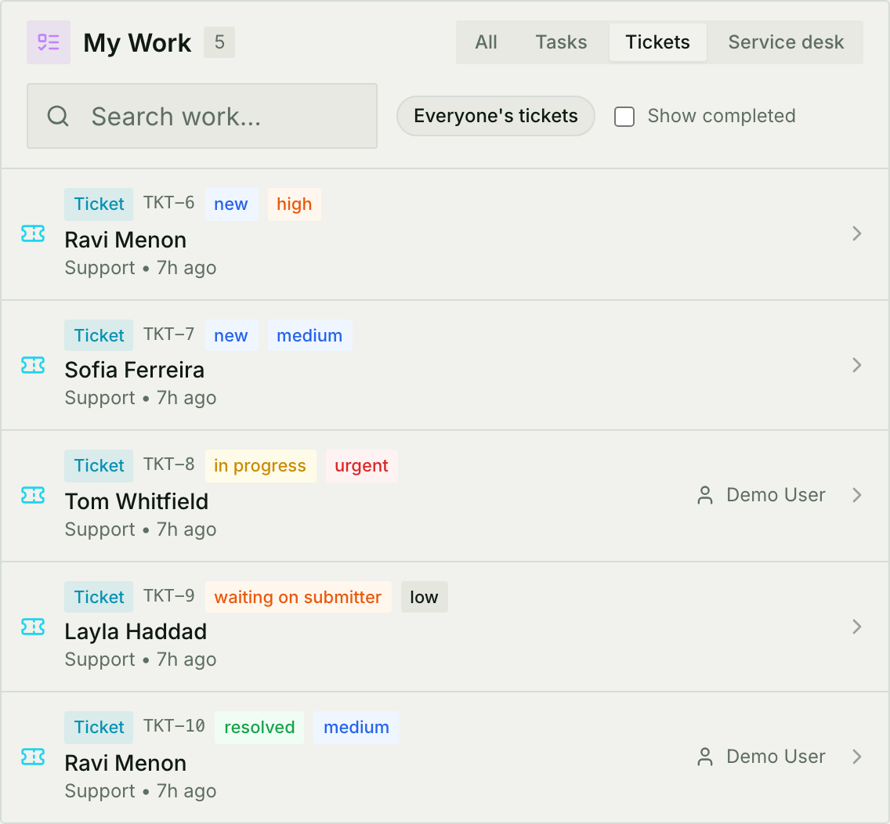
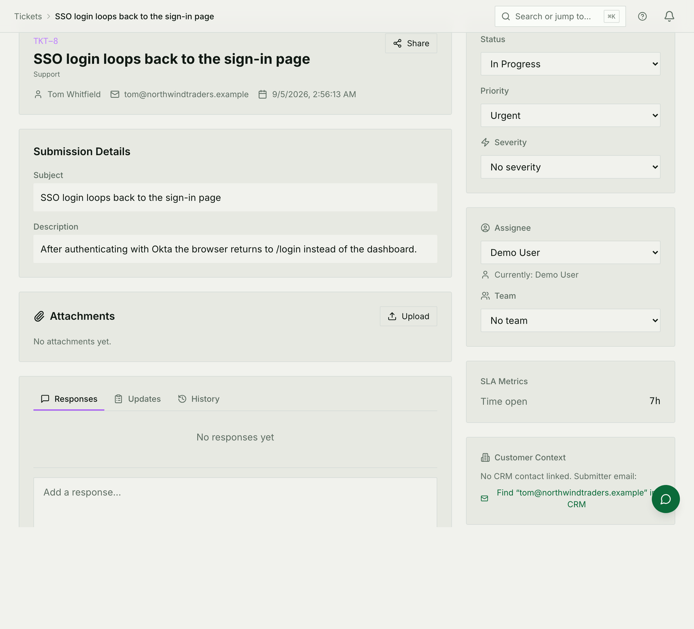
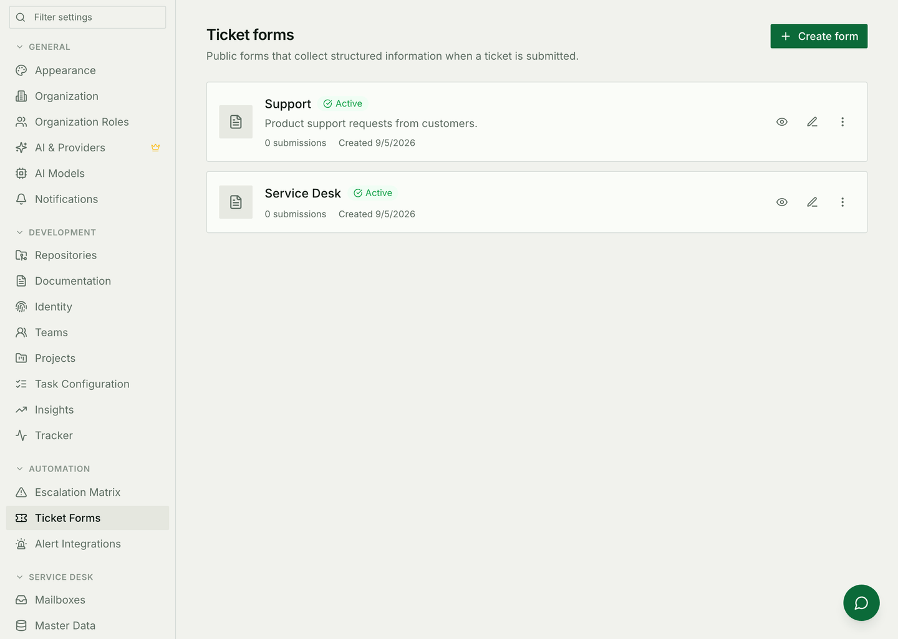
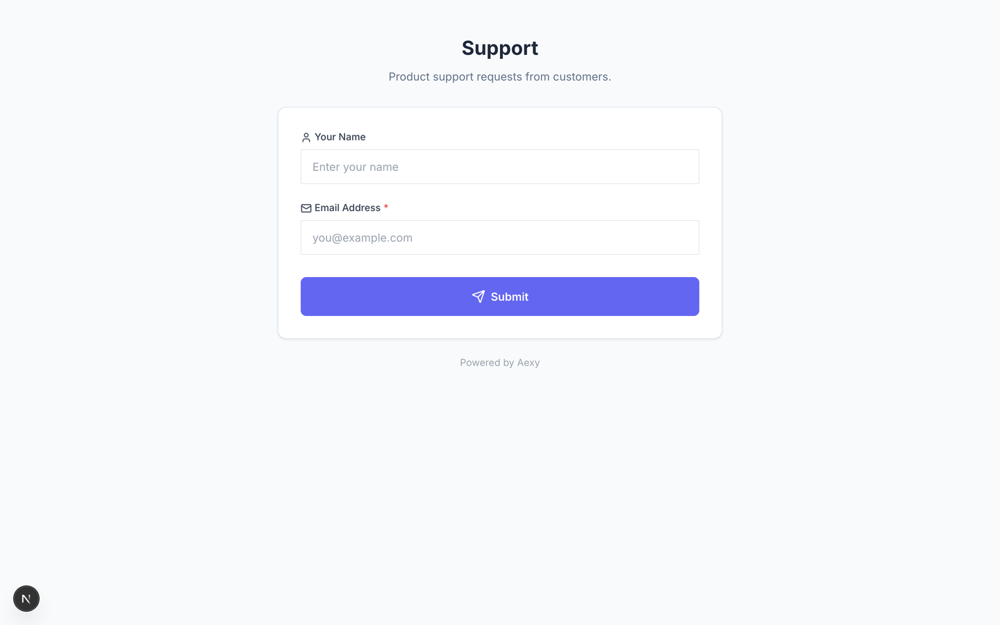

# Tickets & projects

Work that comes *in* from outside the team, and work the team *plans*. They are
different things here, they use different objects, and choosing the wrong one
is the mistake this module produces most often.

For how it is built — models, endpoints, sync — see
[Tickets, projects & tasks architecture](./tickets-and-projects-architecture.md).

## Which thing do I want?

| You have… | Use | Because |
|---|---|---|
| A request from a customer or colleague, usually via a form | **Ticket** | It has a requester who needs answering, and a status the requester can be told about |
| Something the team will estimate and ship | **Task** | It belongs to a sprint, a board and a burndown |
| The same task you create over and over | **Task template** | Scaffolding, not work |
| Email arriving at a shared mailbox | **[Service Desk](./service-desk.md)** | A different module, with handoffs and a turnaround clock |

A ticket becomes a task when the team decides to *do* it — not before. The
ticket keeps its own life and its link to the requester; the task carries the
work. Converting is one click and the two stay linked.

## Where the queue lives



**On the dashboard, not at `/tickets`.** The work list on the home dashboard is
the queue, with a source filter across the top: everything, tasks, form
tickets, or the service desk. `/tickets` still resolves — it is linked from the
command palette, the `t` shortcut and several widgets — but it redirects here.

Two controls on that widget are worth knowing, because the defaults hide most
of the queue:

* **Everyone's tickets / Assigned to me.** It opens on yours. A queue nobody
  has picked up yet is, by definition, not assigned to you.
* **Show completed.** Off by default, so resolved and closed tickets are not in
  the list you are looking at.

A row is labelled by **who raised it** and carries its number, status and
priority. Opening one goes to the ticket.

## A ticket's life

```
new → acknowledged → in progress → [waiting on submitter] → resolved → closed
```

*Waiting on submitter* is the one worth using deliberately: it says the ball is
with the person who raised the ticket, which is what stops it counting against
you while you wait for the account name you asked for.



The detail page is the ticket and the conversation about it in one place.
Replies go to the requester; internal notes do not. Attachments, priority,
assignee and any custom fields live in the same view.

## Getting tickets in



A **form** is how work arrives. Build it at **Settings → Ticket Forms**: add
fields, decide whether the person has to sign in or can submit anonymously, set
the message they see afterwards, and style it to look like your product.

Each form has its own public link:



Anyone with the link can submit; each submission becomes a ticket on the queue
above. There is no account required unless you asked for one.

A form can also route what it collects — into a ticket, a CRM record, or a
deal. See [Forms](./forms.md) for the routing side of it.

## Statuses and fields of your own

The six built-in statuses fit most desks, and a workspace can define its own.
Each custom status belongs to a **category** — to do, in progress, or done —
and that category is what analytics count.

A status named "Done" filed under *in progress* looks perfectly right on the
board and quietly breaks every burndown in the workspace. Set the category
deliberately; it is the field nobody notices until a chart is wrong.

## Projects

A **project** is the container above sprints, boards and tasks: it has members,
teams, and its own settings. Most of what you do inside one is described in
[Sprints & planning](./sprints.md).

The part that belongs here is the **public roadmap**. A project can publish a
read-only view of itself at its own link, with only the tabs you enable —
overview, roadmap, releases, board, and so on. Optionally, visitors can request
features, vote and comment, which is the lightest way to run a public backlog
without giving anyone access to the workspace.

## Common mistakes

- **Looking for the queue at `/tickets`.** It is the dashboard's work list,
  filtered to *tickets*, with *everyone's* switched on.
- **Converting every ticket to a task.** A ticket is already a work item. Turn
  it into a task when the team commits to it, or the board fills with requests
  nobody has agreed to do.
- **A custom status in the wrong category.** The board looks right; the
  burndown does not.
- **Answering a requester in an internal note.** They will not see it, and the
  ticket will look ignored from their side.
- **Using a form ticket where the Service Desk belongs.** If it arrives by
  email, needs a turnaround clock and passes between parties, it is a desk
  ticket. The two modules deliberately do not share a queue.
